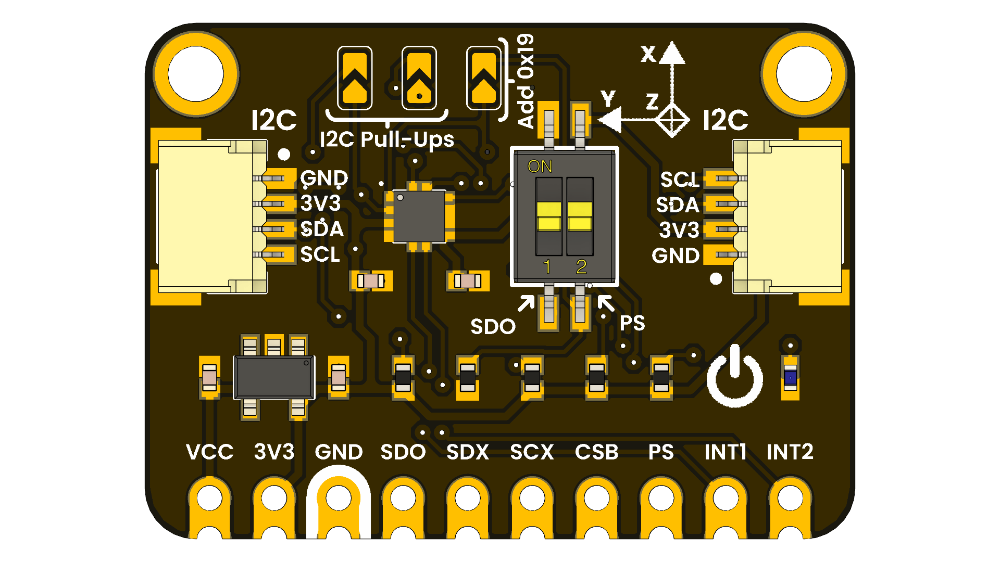

# DevLab: I2C BMA255 Ultra-Low Power Accelerometer Sensor

## Overview

This module features the BMA255, a 3-axis digital accelerometer designed for motion sensing applications. It offers a standard I2C interface, making it easy to integrate into various applications requiring precise acceleration data.

  
  
  
  
   

  
  
<em>BMA255 Digital Accelerometer Module</em>

### Quick Setup

## Overview

| Feature                      | Description                        |
|------------------------------|------------------------------------|
| Sensor Model                 | BMA255                             |
| Interface                    | I2C                                |

## Applications

- Motion detection
- Free-fall detection

## License

This product and its documentation are licensed under the MIT License.  
See [`LICENSE.md`](LICENSE.md) for details.

  Template by UNIT Electronics 

